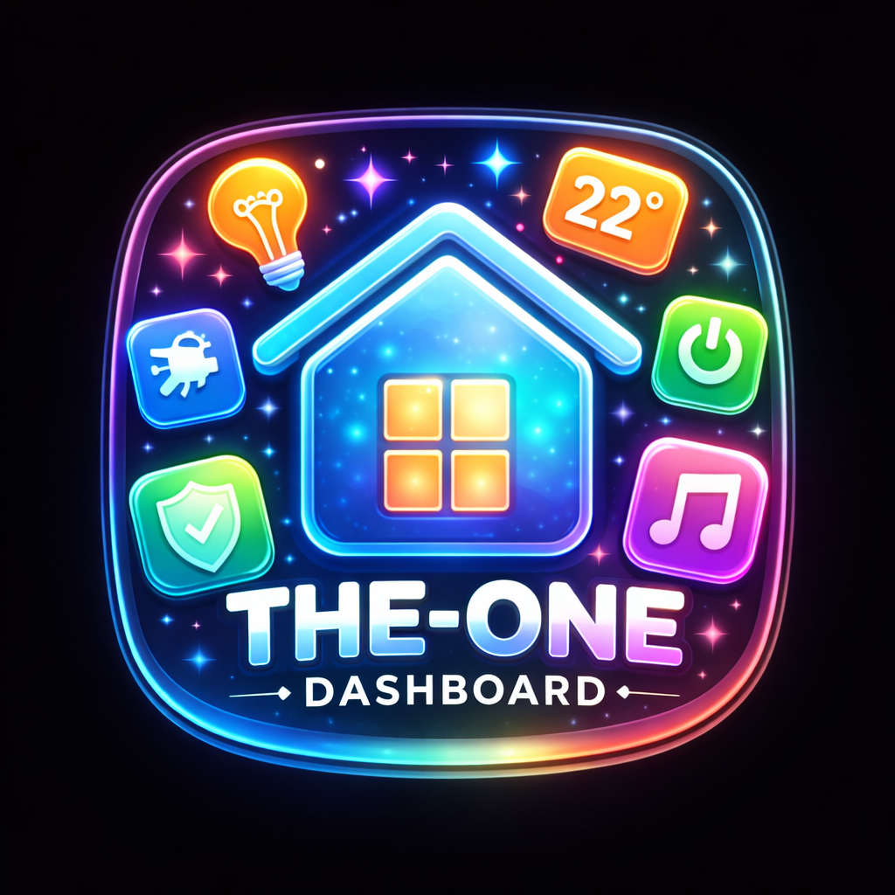

> **⚠️ AI Hobby Project — Work in Progress**
> This project is built with the help of AI (Claude) and is actively under development.
> Features may be incomplete, contain bugs, or change significantly between versions.
> Contributions and feedback are welcome!

---

# The-One Dashboard — HA Add-on Repository

A beautiful, fully customizable Home Assistant dashboard add-on. Displays all your entities as interactive glass tiles organized by area, with real-time WebSocket updates, color light controls, and a smooth Apple Home-inspired UI.

## Installation

1. In Home Assistant go to **Settings → Add-ons → Add-on Store**
2. Click the **⋮** menu (top right) → **Repositories**
3. Paste: `https://github.com/larsoss/lovable`
4. Click **Add** → **Close**
5. Find **The-One Dashboard** in the store and click **Install**
6. Click **Start** — the dashboard appears in your sidebar

## Add-ons

| Add-on | Description |
|--------|-------------|
| [The-One Dashboard](homekit_dashboard/) | Beautiful glassmorphism dashboard for all your HA entities |

## Features

| Feature | Status |
|---------|--------|
| Glassmorphism tile UI | ✅ Done |
| Area cards on Home view | ✅ Done |
| Customizable themes & accent colors | ✅ Done |
| Custom entity icons | ✅ Done |
| Adjustable tile size, shape, opacity | ✅ Done |
| Real-time WebSocket state updates | ✅ Done |
| Drag-and-drop tile reordering | ✅ Done |
| Favorites section | ✅ Done |
| Color picker for Hue/color lights | ✅ Done |
| Edit mode (resize, reorder, hide tiles) | ✅ Done |
| Hide entities from dashboard | ✅ Done |
| Status chips (lights on, switches on…) | ✅ Done |
